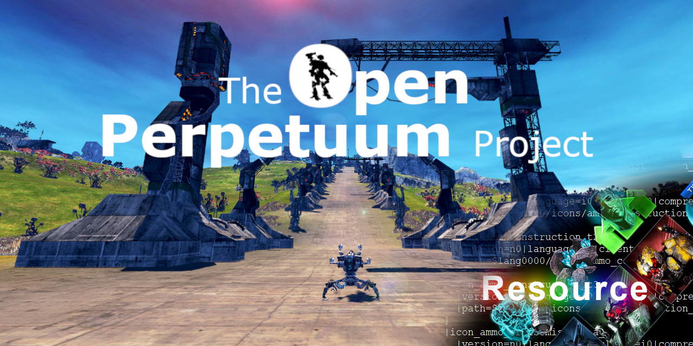

<span style="display:block;text-align:center">

# OPResource

## Quick start

With Node.Js:

1.  Install [Node.js](https://nodejs.org/) .
2.  Download the archive of layers and icons available in the public Google Drive folder here. Note that Gamma_layers is compatible with version P26+.
3.  Extract the contents of the GAMMA_LAYERS_NEW archive to `<PerpetuumServer Directory>\data\layers`.

4.  Add a line to the server configuration file (`<PerpetuumServer Directory>\data\perpetuum.ini`):
- If the OPResource server is on the same computer as the OP server

    ```json
    {
        "ListenerPort": 17700,
        [...]
        "ResourceServerURL": "http://127.0.0.1/",
        [...]
    }
    ```

- if the OPResource resource server is on a separate computer from the OP server or you are preparing a public server

    ```json
    {
        "ListenerPort": 17700,
        [...]
        "ResourceServerURL": "http://my.server.url/",
        [...]
    }
    ```

> [!CAUTION]
> The name of the OPResource server (in this example, it is my.server.url) must be resolvable on both the OP server and the OP clients.
> This can be achieved either by an A record on the DNS servers of the corresponding domain zone or for a test installation in the hosts files.
> For Linux, this is `/etc/hosts`, for Windows - `C:\Windows\System32\drivers\etc\hosts`.

5.  In the command line, navigate to the folder with the cloned repository.
    - For the first run, you need to install dependencies. To do this, enter the command:

    ```sh
    npm i
    ```

    - Once the dependencies are installed, you can start the OPResource resource server with the following command:

    ```sh
    node index.js
    ```

To start the OPResource resource server with `docker compose`, use the ready-made `docker-compose.yml` file in the root of this repository.

Or see Documentation

## Documentation
[Consult AC's Github Wiki](https://github.com/PerpetuumOnline/PerpetuumServer/wiki/Custom-Resource-Servers)
